<div align="center">

# PitDB Architecture

**The full system design: storage model, query engine internals, bitemporal versioning, and the reasoning behind every major decision.**

[← Back to README](README.md) · [Benchmark methodology](METHODOLOGY.md)

</div>

<br/>

This is the deep-dive companion to [the README](README.md). Where the README
answers *what PitDB does and how fast*, this document answers *how it's
built and why it's built that way* — down to the data structures, the
predicate evaluation contract, and the concurrency-free invariants that make
bitemporal correctness possible without a second storage engine.

## Contents

- [1. What this system is](#1-what-this-system-is)
- [2. System overview](#2-system-overview)
- [3. The storage model](#3-the-storage-model)
  - [3.1 Data model](#31-data-model)
  - [3.2 Chunk lifecycle](#32-chunk-lifecycle)
  - [3.3 Component responsibilities](#33-component-responsibilities)
- [4. The query engine](#4-the-query-engine)
  - [4.1 Execution flow](#41-execution-flow)
  - [4.2 The predicate IR and its three evaluation modes](#42-the-predicate-ir-and-its-three-evaluation-modes)
- [5. Bitemporal versioning](#5-bitemporal-versioning)
  - [5.1 The problem](#51-the-problem)
  - [5.2 The model](#52-the-model)
  - [5.3 Two ingestion paths, deliberately kept apart](#53-two-ingestion-paths-deliberately-kept-apart)
  - [5.4 Version resolution: latest-transaction-time-wins](#54-version-resolution-latest-transaction-time-wins)
  - [5.5 Compaction](#55-compaction)
- [6. The transaction-time index](#6-the-transaction-time-index)
- [7. Design decisions and why](#7-design-decisions-and-why)
- [8. Module reference and dependency graph](#8-module-reference-and-dependency-graph)

## 1. What this system is

PitDB is a chunked, columnar time-series storage and query engine for
OHLCV (open/high/low/close/volume) market data, with **bitemporal
versioning**: every stored fact carries both a *valid time* (when the event
happened) and a *transaction time* (when the system learned about it), so a
query can ask "what did we know, as of this point in time" without ever
leaking a future correction into a past-dated decision — the core guarantee
a backtesting engine needs to avoid look-ahead bias.

The design center of the project is **conservative predicate pushdown**:
rather than compressing data (the project's first iteration used XOR/Gorilla-
style delta compression and deliberately moved away from it — see
[§7](#7-design-decisions-and-why)), every chunk carries a small, cheap-to-
check *zone map* (min/max bounds on symbol, valid time, price, and
transaction time). A query prunes chunks it can *prove* are irrelevant using
only that zone map, and only decompresses the survivors. The system's
correctness bar, enforced throughout by tests, is that this pruning must
never produce a false negative — it may keep a chunk that turns out not to
match, but it must never discard one that does.

## 2. System overview

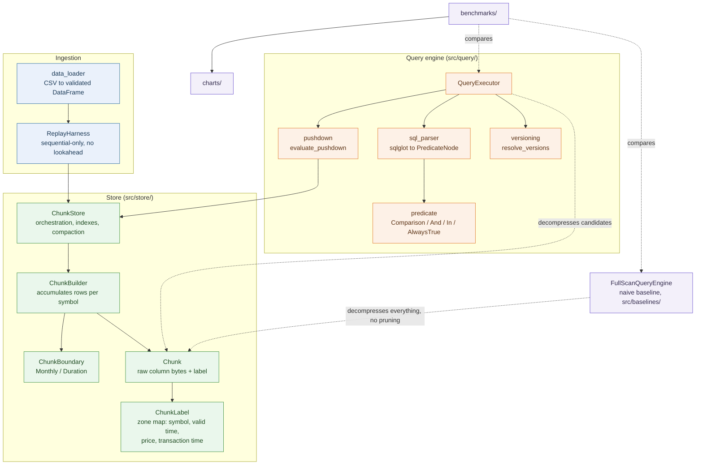

**What this shows:** the complete data path across the four package
boundaries (`replay/`, `store/`, `query/`, `baselines/`). Ingestion (blue)
only ever produces chunks; the query engine (amber) only ever consumes them;
`FullScanQueryEngine` (purple) deliberately duplicates none of the pushdown
machinery — it decompresses everything, unconditionally, so it can serve as
an independent correctness oracle. `benchmarks/` treats both engines as
black boxes and compares their outputs and latencies directly.

## 3. The storage model

### 3.1 Data model

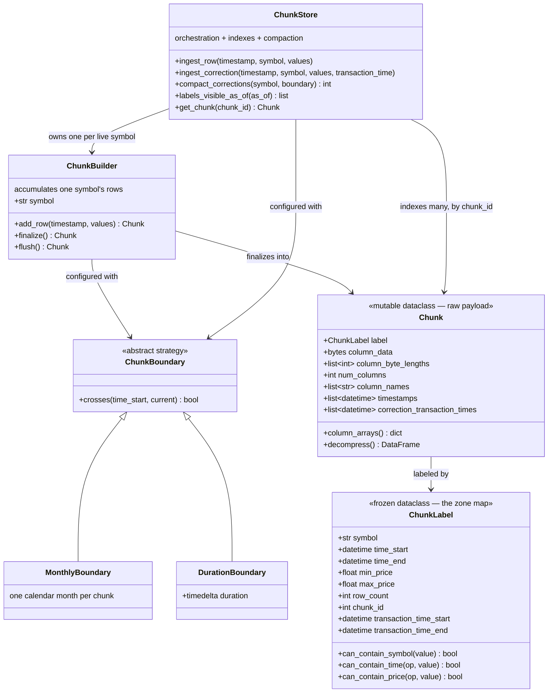

**What this shows:** every relationship in the storage layer, verified
directly against the dataclass definitions in `src/store/`. `ChunkLabel` is
the only thing pushdown pruning is ever allowed to look at before deciding
whether to decompress a chunk — `can_contain_symbol` / `can_contain_time` /
`can_contain_price` are pure, conservative predicates: `False` is a *proof*
of non-membership, `True` means "maybe, decompress and check exactly." An
all-NaN chunk's price range is represented as `(+inf, -inf)`, which makes
every finite/NaN comparison correctly return `False` with no special-cased
branch.

`transaction_time_start`/`_end` being `None` means "this is base data,
learned at its own valid time, one row at a time." A non-`None` pair marks a
**correction chunk**, whose rows were learned later than their own valid
time. This single nullable pair — not a second parallel class hierarchy — is
what lets the exact same struct, and the exact same pruning code path, serve
both plain time-series storage and bitemporal correction storage (see
[§5](#5-bitemporal-versioning)).

### 3.2 Chunk lifecycle

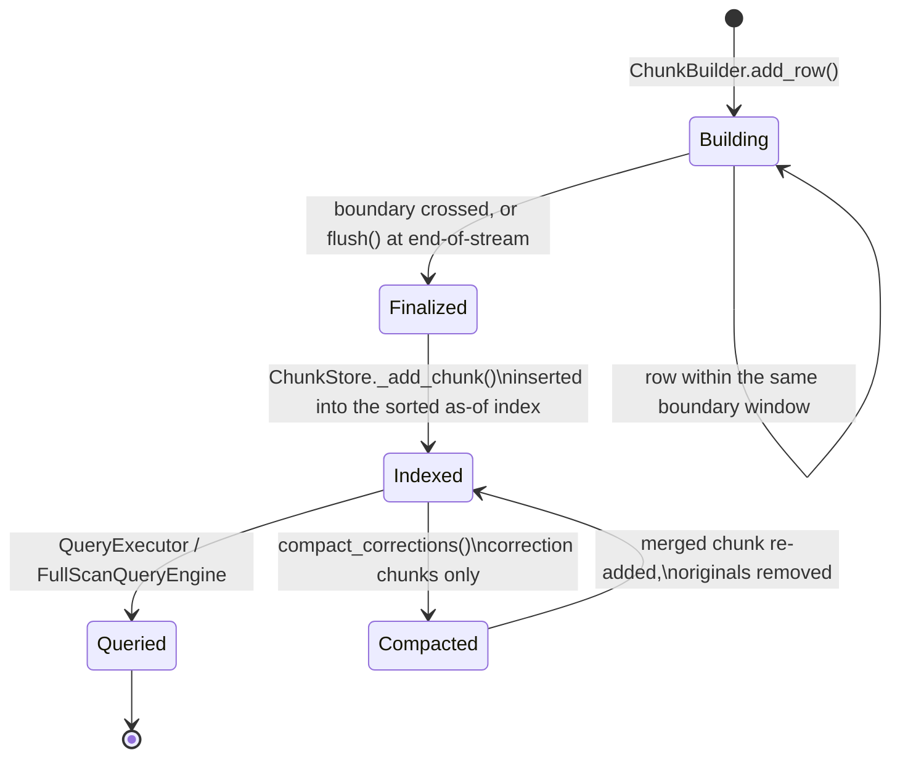

**What this shows:** a chunk is either being built (mutable accumulation
inside a `ChunkBuilder`) or finalized (immutable payload, indexed, and
queryable) — there is no third state. Only correction chunks ever take the
`Compacted` transition; base chunks are never read or rewritten by
`compact_corrections()`. `Indexed` and `Queried` are not mutually exclusive
— a chunk stays indexed and queryable indefinitely; `Queried` just marks
that a read happened.

### 3.3 Component responsibilities

**`ChunkLabel`** (`src/store/label.py`) — see [3.1](#31-data-model) for its
full shape. It's a frozen dataclass specifically so pruning logic can never
accidentally mutate the zone map it's reasoning about.

**`Chunk`** (`src/store/chunk.py`) — each value column (`open`, `high`,
`low`, `close`, `volume`) is stored as a contiguous run of raw `float64`
bytes, back to back, with a byte-length table for re-slicing
(`column_arrays()`). `decompress()` reassembles a full `pandas.DataFrame`
when a query actually needs one; `column_arrays()` skips that construction
entirely and hands back plain `numpy` arrays for callers (like compaction)
that only need the underlying values, not a DataFrame — a real, measured
performance difference (see
[METHODOLOGY.md §4](METHODOLOGY.md#4-the-first-audit-finding-correctness-and-performance-bugs-with-evidence-not-guesses)).
A correction chunk additionally carries
`correction_transaction_times: list[datetime]`, positionally aligned with
its rows — required once a single chunk can hold corrections learned at
different times (after compaction merges several).

**`ChunkBuilder` / `ChunkBoundary`** (`src/store/chunk_builder.py`,
`chunk_boundary.py`) — `ChunkBuilder` accumulates one symbol's rows until
`ChunkBoundary.crosses()` says the window is full (`MonthlyBoundary` for
daily bars, `DurationBoundary` for intraday data), then finalizes a `Chunk` +
`ChunkLabel` pair. The **non-decreasing valid-timestamp check** here is the
project's core no-lookahead invariant: a builder physically cannot accept a
row that goes backward in time relative to what it has already seen.

**`ChunkStore`** (`src/store/chunk_store.py`) — owns one `ChunkBuilder` per
symbol, a `chunk_id -> Chunk` dict for O(1) lookup, and a **sorted
transaction-time index** (see [§6](#6-the-transaction-time-index)). Base
ingestion (`ingest_row` / `ingest_from_replay`) and correction ingestion
(`ingest_correction`) are **deliberately separate code paths** that never
touch each other's state — see [§5.3](#53-two-ingestion-paths-deliberately-kept-apart).

## 4. The query engine

### 4.1 Execution flow

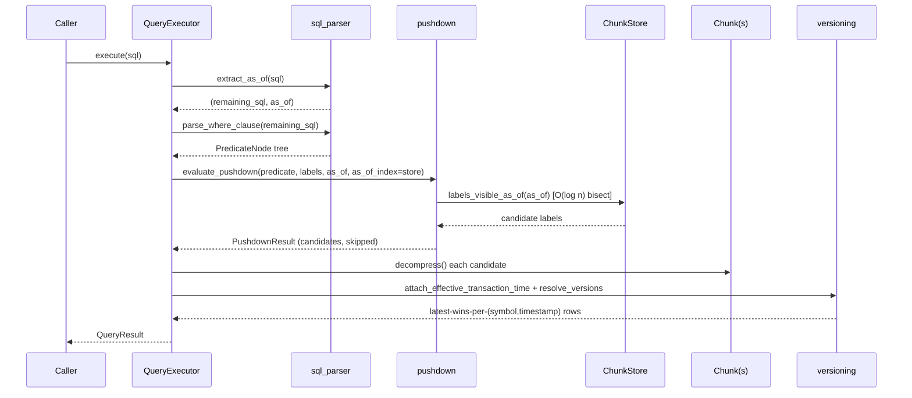

1. **`sql_parser.py`** — a hand-rolled, bounded SQL subset built on
   `sqlglot`. `parse_where_clause` lowers the WHERE clause into the
   project's own IR ([§4.2](#42-the-predicate-ir-and-its-three-evaluation-modes));
   `extract_as_of` separately locates a `TIMESTAMP AS OF '<ts>'` clause (the
   same syntax and placement Delta Lake and SQL Server use) and strips it
   before the WHERE clause is parsed, so the two concerns never interfere
   with each other. It's tokenizer-based, not a full parse: raw lexical
   analysis only, anchored to the exact token position immediately after the
   table reference, matching the clause's own documented placement.
   Comments are discarded before tokenization ever produces output and a
   string literal — however it's quoted or escaped — always comes through as
   one opaque token, so neither can be mistaken for the keyword sequence
   being matched; an earlier regex-based version could be defeated by a SQL
   comment containing the word "where" (see
   [METHODOLOGY.md §5](METHODOLOGY.md#5-a-second-audit-performance-loopholes-and-benchmark-methodology-honesty)).
   Unsupported SQL (subqueries, joins, `OR`, aggregates) is rejected
   explicitly rather than silently mishandled.

2. **`pushdown.py`** — `evaluate_pushdown` partitions chunk IDs into
   candidates and provably-skippable chunks. Its contract:
   `evaluate_against_label` returning `False` **must** be a proof, never a
   guess. The `as_of_index` parameter is a `Protocol`-typed optional fast
   path (structurally satisfied by `ChunkStore`, not imported by name — this
   module still depends only on `list[ChunkLabel]`) that swaps the O(n)
   per-label scan for an O(log n) index lookup when both `as_of` and the
   index are supplied — by consulting the index as an O(1) membership test
   while still iterating labels in their original order, so results are
   identical (content *and* order) to the plain linear scan below regardless
   of which path ran; omitting `as_of_index` is byte-for-byte identical to
   the original linear scan, so every existing caller is unaffected.

3. **`QueryExecutor`** — parses, prunes, decompresses only the survivors,
   applies the vectorized predicate mask once over the concatenated frame
   (not once per chunk — a deliberate optimization, see inline comment in
   `executor.py`), and — only when an `AS OF` cutoff or a correction chunk is
   actually in play — resolves per-`(symbol, timestamp)` duplicates to the
   newest version visible as of that cutoff.

4. **`FullScanQueryEngine`** (`src/baselines/full_scan.py`) — the naive
   baseline: decompresses *every* chunk, never consults a label, applies the
   same predicate row-by-row. Every benchmark and most tests assert full
   row/value/dtype equality between this and `QueryExecutor`'s output before
   ever reporting a speedup number — pushdown pruning that returns the wrong
   rows faster is not a feature.

### 4.2 The predicate IR and its three evaluation modes

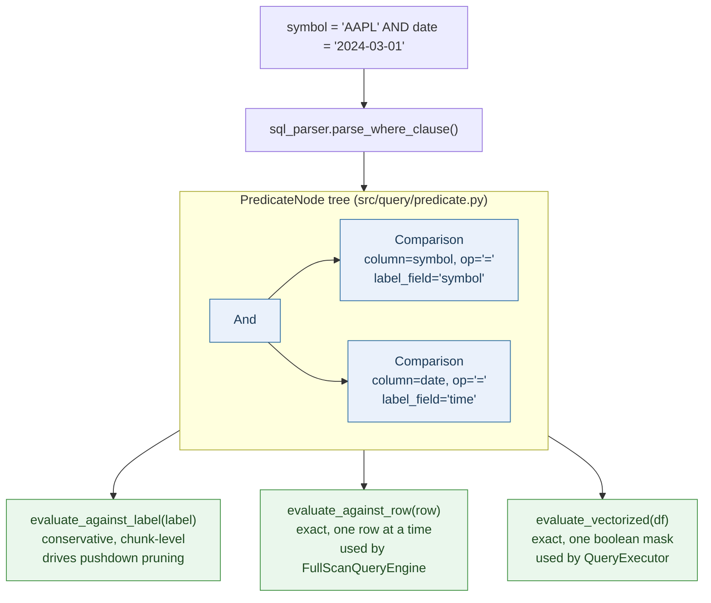

**What this shows:** one WHERE clause becomes one `PredicateNode` tree
(`Comparison` / `And` / `In` / `AlwaysTrue`, all in `predicate.py`), and that
*same* tree drives three independent evaluation paths that must always
agree with each other. This three-way redundancy is deliberate — it's what
lets `FullScanQueryEngine` and `QueryExecutor` share zero query-evaluation
code while still being required to produce byte-identical results.
`_align_literal_to_reference` and `_coerce_row_operands`/
`_coerce_column_literal` centralize the timezone-awareness alignment every
comparison needs; keeping this logic in one place is what closed two real
bugs an earlier correctness audit found (see
[METHODOLOGY.md](METHODOLOGY.md)). `evaluate_against_label` also takes
`price_pruning_enabled: bool = True`: once a store has any correction chunk
(`ChunkStore.has_corrections`), price-based pruning is disabled so a
correction's own value can never hide it from candidacy — symbol and time
pruning stay enabled either way.

## 5. Bitemporal versioning

### 5.1 The problem

Market data gets revised — busted trades, corrected prints, restated bars.
`ChunkBuilder._validate_row` rejects any out-of-order valid timestamp the
same way it would reject a bug, because the store had exactly one timeline.
A correction has no way to exist without either mutating history (silently
invalidating anything that already queried it) or being rejected outright.

### 5.2 The model

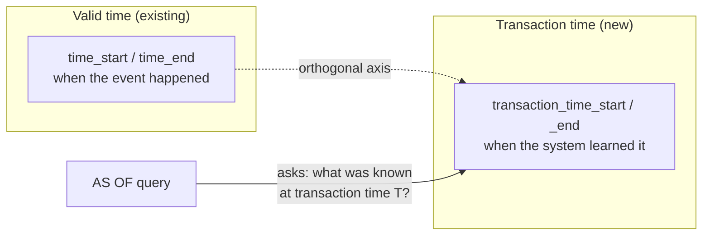

Grounded in Snodgrass's 1985 taxonomy of database time (the paper that
coined the valid-time/transaction-time split and the `AS OF` clause itself,
via TQuel) and the same model TDSQL, Delta Lake, Apache Hudi, and XTDB all
converge on independently. `time_start`/`time_end` already existed for valid
time; `transaction_time_start`/`_end` is the new, orthogonal axis.

### 5.3 Two ingestion paths, deliberately kept apart

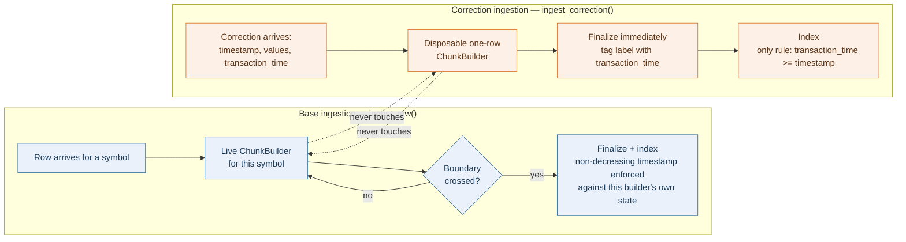

**What this shows:** `ChunkStore.ingest_correction` is **not** a variant of
`ingest_row` — it never touches `self._builders`, so the live per-symbol
builder's non-decreasing causality contract is completely undisturbed. It
builds a throwaway single-row `ChunkBuilder` (reusing the exact same
validation, price-zone computation, and byte-packing logic finalized chunks
use — no parallel implementation to silently diverge from it), tags the
resulting label with the caller-supplied transaction time, and appends it.
The one causality rule enforced: `transaction_time >= timestamp` — you
cannot learn about an event before it happens.

### 5.4 Version resolution: latest-transaction-time-wins

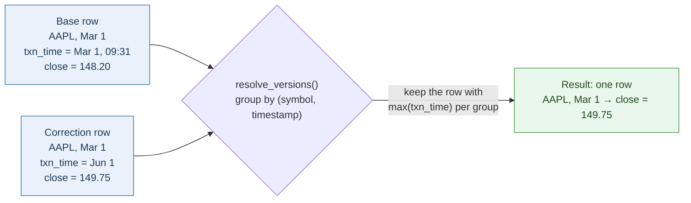

```python
def attach_effective_transaction_time(frame, chunk) -> pd.DataFrame:
    # base chunk: each row's own timestamp is its transaction time
    # correction chunk: the label's per-row correction_transaction_times
    ...

def resolve_versions(df, txn_col="_txn_time") -> pd.DataFrame:
    # group by (symbol, timestamp); keep the row with the max txn_col
```

This subsumes the recommendation's original "supersedes pointer" idea
without needing one — it's strictly more general (handles
overlapping/partial corrections that don't align to prior chunk boundaries)
and requires no bookkeeping. **A validating property**: with zero
corrections ever ingested, `AS OF T` is provably identical to a plain
`timestamp <= T` filter — the bitemporal machinery collapses to a no-op, and
this equivalence is asserted directly in `tests/test_bitemporal.py`.

### 5.5 Compaction

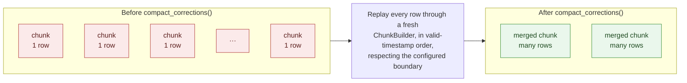

**What this shows:** each `ingest_correction` call produces its own
single-row chunk — cheap to write, but a store with heavy correction volume
accumulates many tiny chunks. `compact_corrections()` merges same-symbol
correction chunks into fewer, larger ones, mirroring Delta Lake's
`OPTIMIZE`, Apache Hudi's compaction table service, and TDSQL's asynchronous
migration-to-historical-table: writes stay cheap and never block,
consolidation happens later via an explicit, idempotent maintenance call.
Measured directly: at 50% correction density, one run merged 5,490
correction chunks down to 951 in under 60ms (see
[METHODOLOGY.md](METHODOLOGY.md) for the full before/after
numbers, including the O(n²) bug this call path used to have).

It replays merged rows through a fresh `ChunkBuilder` in valid-timestamp
order (required, since corrections can target any past timestamp in any
ingestion order), so a merge naturally respects the configured
`ChunkBoundary` — or an explicit coarser `boundary` override, since
correction chunks don't need base data's fine pruning granularity.
Compaction is provably safe: it only ever changes zone-map *granularity*,
never the per-row `correction_transaction_times` that row-level resolution
actually relies on — the same invariant every other zone-map field in this
codebase already leans on.

## 6. The transaction-time index

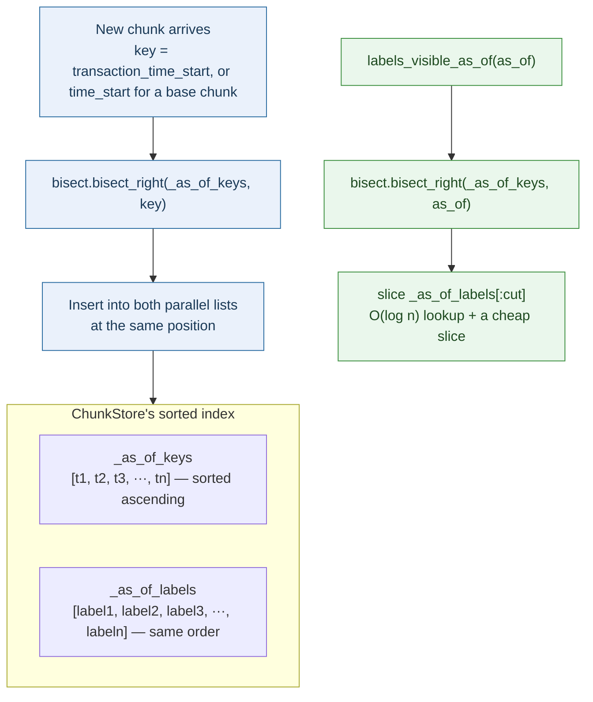

**What this shows:** a one-dimensional threshold query
(`transaction_time <= as_of`) only needs a sorted list and `bisect`, not a
two-dimensional structure like the R-tree TDSQL uses for interval-overlap
queries (`BETWEEN`) this project doesn't support. `ChunkStore` maintains two
parallel lists sorted by `transaction_time_start` (or `time_start` for base
chunks), updated on insert (`bisect.bisect_right` + `list.insert`) and on
batched removal (a single filtering pass across both structures — removing
many chunks per call, not one at a time, was itself a real O(n²) bug found
and fixed by profiling; see [METHODOLOGY.md](METHODOLOGY.md)).
`labels_visible_as_of`/`labels_not_visible_as_of` answer "which labels
are/aren't visible as of T" in O(log n) plus a cheap slice.

## 7. Design decisions and why

| Decision | Rationale |
|---|---|
| Raw `float64` storage, not XOR/Gorilla compression | An earlier iteration of this project used delta/XOR compression; it was deliberately abandoned in favor of raw storage so predicate pushdown could operate on uncompressed zone maps without a decode step. Compression ratio is intentionally ~1.0x — a documented trade-off, not an oversight. |
| `AS OF` via a nullable `transaction_time_start`/`_end` pair, not a separate correction table | Keeps one code path (`ChunkLabel`, one pushdown contract) instead of two parallel storage models to keep in sync. |
| `bisect`-based sorted index, not an R-tree | The system only needs a 1D threshold query today; an R-tree would be solving a 2D problem (interval overlap) this project doesn't have. |
| Corrections replay through `ChunkBuilder`, not a bespoke merge writer | Reuses the exact same validation, price-zone, and byte-packing logic finalized chunks already use — eliminates a whole class of "two implementations silently diverge" bugs. |
| `compact_corrections()` is explicit and idempotent, not automatic | Matches Delta Lake/Hudi/TDSQL: writes stay cheap and predictable; consolidation is a deliberate, separately-timed maintenance operation. |
| Chunk boundary granularity is user-configurable (`MonthlyBoundary`, `DurationBoundary`, or a coarser override for compaction) | A direct, measured trade-off exists between pruning precision and chunk-management overhead — see `benchmarks/bench_chunk_granularity.py` and the selectivity-crossover discussion in [METHODOLOGY.md](METHODOLOGY.md). |
| `extract_as_of` locates its clause via `sqlglot`'s tokenizer, not a full parse | A full re-parse under a different dialect (to natively recognize the syntax) once corrupted quoted identifiers and escaped-quote literals elsewhere in the same query; a later plain-text regex fix over the raw SQL could then be defeated by a SQL comment containing the word "where". Tokenizing is the narrowest tool that's actually immune to both failure modes — comments and string literals never survive as matchable text. |

## 8. Module reference and dependency graph

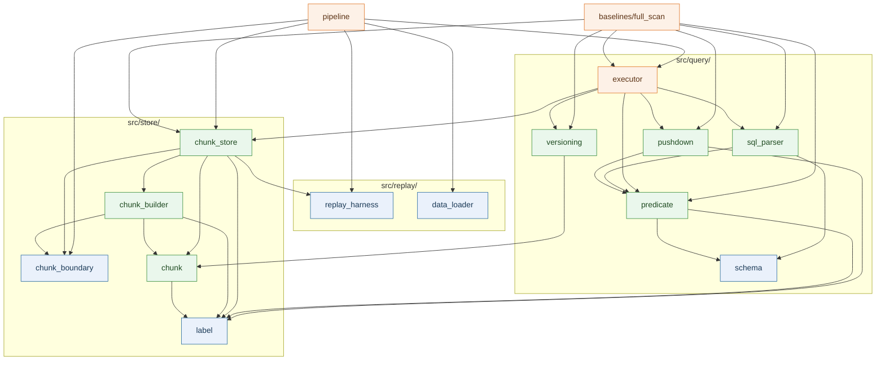

**What this shows:** every intra-project `import` edge in `src/`, extracted
directly from the source rather than inferred — an arrow means "depends on."
`label.py`, `chunk_boundary.py`, `schema.py`, `data_loader.py`, and
`replay_harness.py` (blue) have zero intra-project dependencies. Nothing
above them ever imports back down into `query/executor.py`,
`baselines/full_scan.py`, or `pipeline.py` (amber) — the dependency graph is
strictly layered, with no cycles, which is what makes it possible to unit
test `store/` and `query/predicate.py` in complete isolation from the query
engine that consumes them.

| Path | Responsibility |
|---|---|
| `src/replay/data_loader.py` | Load and validate a merged OHLCV CSV |
| `src/replay/replay_harness.py` | Strict sequential, no-lookahead row iterator — the sole ingestion-facing view of a DataFrame |
| `src/store/chunk_boundary.py` | `ChunkBoundary` (Monthly / Duration) — decides when a chunk window closes |
| `src/store/chunk_builder.py` | Accumulates one symbol's rows into a finalized `Chunk` |
| `src/store/chunk.py` | Raw column-byte storage, `decompress()`, `column_arrays()` |
| `src/store/label.py` | `ChunkLabel` — the immutable zone map |
| `src/store/chunk_store.py` | Ingestion orchestration, chunk indexing, compaction, transaction-time index |
| `src/query/schema.py` | Canonical column schema, SQL aliases, typed literal parsing |
| `src/query/predicate.py` | Predicate-tree IR and its three evaluation modes |
| `src/query/sql_parser.py` | SQL → predicate tree; `AS OF` extraction |
| `src/query/pushdown.py` | Conservative chunk-candidate selection |
| `src/query/versioning.py` | Bitemporal row-level version resolution |
| `src/query/executor.py` | End-to-end query execution |
| `src/baselines/full_scan.py` | Naive baseline for correctness/speed comparison |
| `src/pipeline.py` | CLI: ingest a CSV, run queries, optionally benchmark |
| `benchmarks/` | The full benchmark suite — see [METHODOLOGY.md](METHODOLOGY.md) |
| `benchmarks/report.py` | Shared table rendering and number formatting every `bench_*.py` script uses for its final summary |
| `charts/` | Chart generation from benchmark JSON output |

<br/>

<div align="center">

[← Back to README](README.md) · [Benchmark methodology →](METHODOLOGY.md)

</div>
</content>
