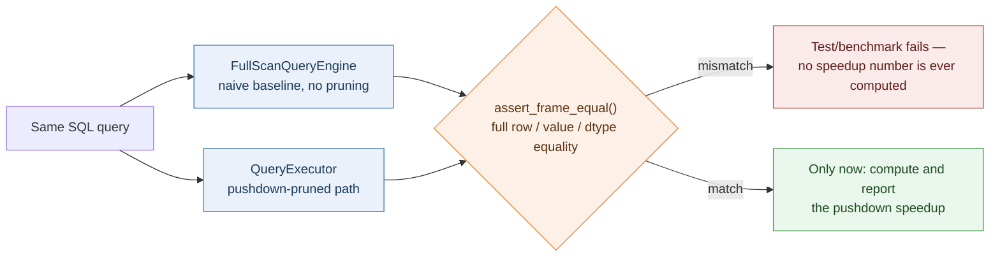
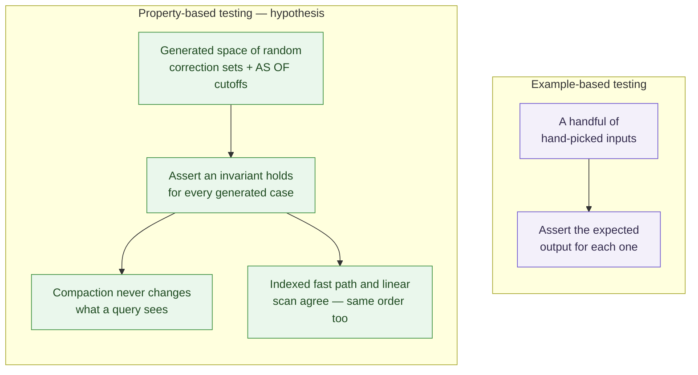
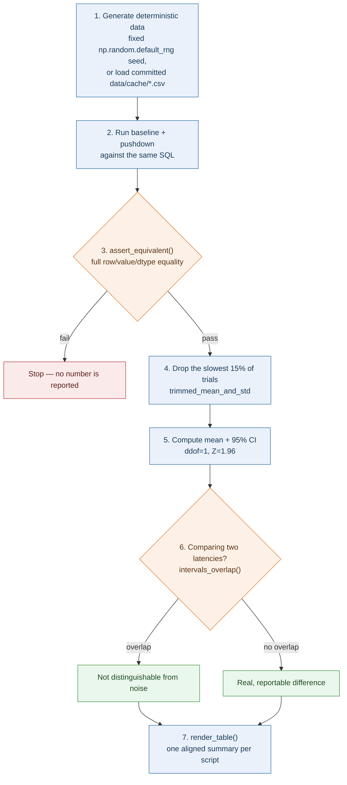
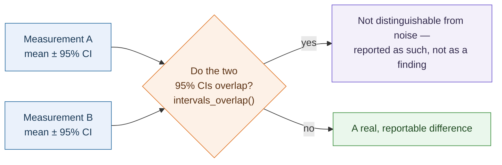
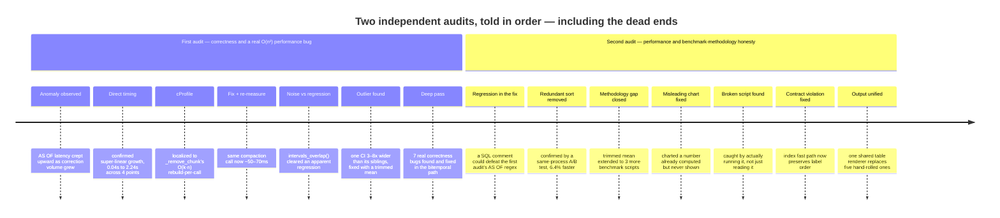
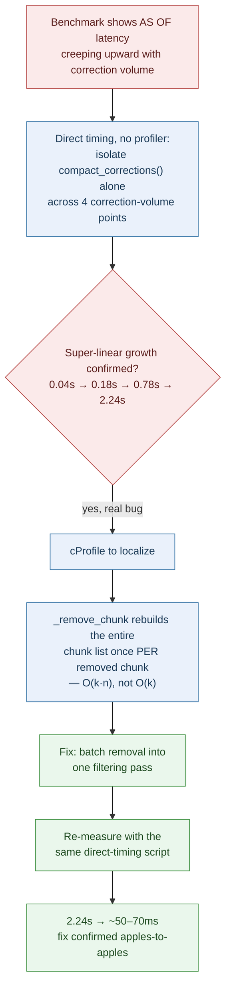

# PitDB Methodology

**How correctness is proven, how performance is measured honestly, and the full story of two self-audits that found real bugs.**

[← Back to README](README.md) · [Architecture deep-dive](ARCHITECTURE.md)

 

This is the "how do we know it's true" companion to
[ARCHITECTURE.md](ARCHITECTURE.md). It covers four things: how correctness is
proven (not just tested), how performance claims are measured (not just
eyeballed), the audits that found and fixed real bugs this project shipped
with — told honestly, including the dead ends — and the exact, current
numbers behind every claim in [the README](README.md).

## Contents

- [1. Correctness philosophy](#1-correctness-philosophy)
- [2. Benchmark design](#2-benchmark-design)
- [3. Headline, verified results](#3-headline-verified-results)
- [Audit trail, at a glance](#audit-trail-at-a-glance)
- [4. The first audit](#4-the-first-audit-finding-correctness-and-performance-bugs-with-evidence-not-guesses)
- [5. A second audit](#5-a-second-audit-performance-loopholes-and-benchmark-methodology-honesty)
- [6. Reproducibility](#6-reproducibility)
- [7. Known limitations](#7-known-limitations--explicitly-deferred-work)

## 1. Correctness philosophy

The project's actual technical identity is **provably correct time-series
query semantics**, not raw speed. Every pruning decision in the pushdown path
follows one rule, repeated verbatim in code comments throughout the codebase:

> `evaluate_against_label` returning `False` must be a proof of non-membership.
> `True` may be a false positive ("maybe, decompress and check exactly") but
> `False` may never be a false negative.

Two mechanisms enforce this in practice.

**Full-scan equivalence, everywhere.**

`FullScanQueryEngine` decompresses every chunk unconditionally and never
consults a label. Every fixed benchmark query (Q1–Q5, Dataset B's three
queries, every bitemporal correction-rate scenario) asserts
`pd.testing.assert_frame_equal` between the pushdown path's output and this
naive baseline's output — full row/value/dtype equality, not just a row
count — before any speedup number is ever reported. This is what caught two
real bugs early in the project's life (`In.evaluate_against_row` silently
diverging from its vectorized twin on timezone-aware comparisons, and
`evaluate_against_label` misusing its own alignment helper asymmetrically)
and several more in the audits documented in
[§4](#4-the-first-audit-finding-correctness-and-performance-bugs-with-evidence-not-guesses)
and
[§5](#5-a-second-audit-performance-loopholes-and-benchmark-methodology-honesty)
below.

**Property-based equivalence proofs for the bitemporal machinery.**

`tests/test_compaction.py` and `tests/test_as_of_index.py` use `hypothesis`
to check two invariants across a *generated* space of random inputs, not
just a handful of hand-picked examples:

- Compaction never changes what a query sees — for random correction sets and
  random `AS OF` cutoffs, results before and after `compact_corrections()`
  must be byte-identical.
- The transaction-time index never disagrees with the linear scan it
  replaces — for random label sets and random `AS OF` values, the indexed
  fast path and the O(n) fallback must partition chunks into the same
  candidate/skipped sets, **in the same order** (tightened in
  [§5](#5-a-second-audit-performance-loopholes-and-benchmark-methodology-honesty)
  after the second audit found the order guarantee didn't always hold).

This is the actual "scientifically proven" bar for this project: an
equivalence property checked over a generated input space, not asserted from a
few examples.

## 2. Benchmark design

Every benchmark in `benchmarks/` follows the same seven-step shape,
established in `bench_query.py` and carried through every later addition:

1. Generate deterministic synthetic data (fixed `np.random.default_rng` seeds)
   or load the committed real-market-data fixtures in `data/cache/`.
2. Run the naive baseline and the pushdown path against the *same* SQL.
3. Assert full equivalence (`_assert_equivalent`) — a speedup number is never
   computed from results that weren't first proven identical.
4. Report mean latency with a **95% confidence interval**
   (`benchmarks/stats.py::confidence_interval_95`), using `ddof=1` (sample
   std) rather than numpy's default `ddof=0`, which systematically
   understates variability — most visible at small trial counts.
5. Drop the slowest 15% of trials before computing statistics
   (`trimmed_mean_and_std`) — latency outliers from a GC pause or OS
   scheduling hiccup are strictly one-directional, and a single such trial
   can otherwise blow out a reported confidence interval far wider than every
   other measurement's. Applied consistently across every script as of §5.
6. Where two latencies are being compared (consecutive fixed queries, or a
   before/after change), flag whether their CIs overlap
   (`intervals_overlap`) — two means whose 95% CIs overlap are **not**
   distinguishable from noise at that confidence level, and reporting only
   point estimates invites reading a real effect into what might be OS
   scheduling jitter or a GC pause.
7. Print one clean, aligned summary table at the end of the run
   (`benchmarks/report.py::render_table`) — the single shared formatting
   layer every script uses, added in §5.

`scipy` is not a project dependency, so confidence intervals use the normal
(Z = 1.96) rather than the exact Student's-t critical value — a documented,
slightly optimistic (narrow) approximation at low trial counts, not an exact
interval.

**Step 6, isolated** — this is the single check that keeps every "X vs. Y"
claim in this document honest:

### The benchmark suite

| Script | Measures |
|---|---|
| `bench_query.py` (via `run_all.py`) | Fixed queries Q1–Q5 on real daily/intraday market data: full-scan vs. pushdown latency, selectivity, chunks-skipped-ratio, pairwise significance between consecutive queries, and an isolated price-vs-date-only pruning demonstration |
| `bench_memory.py` | Peak RSS and raw-vs-stored byte footprint |
| `bench_scale.py` | Ingestion throughput, isolated pushdown-eval cost, and query latency as synthetic scale grows 1x → 1000x (10 → 10,000 symbols) |
| `bench_bitemporal.py` | `ingest_correction`/`compact_corrections` throughput, AS-OF pushdown-pruning effectiveness, and end-to-end query latency — each scenario measured **both before and after compaction**, with significance annotations, so compaction's real effect is visible directly from one run |
| `bench_chunk_granularity.py` | The pruning-precision-vs-chunk-management-overhead trade-off across weekly/monthly/quarterly chunk boundaries, for a fixed combined predicate |

## 3. Headline, verified results

All figures below are read directly from the current `benchmarks/results/*.json`
files, generated by the commands in [the README](README.md#running-the-benchmark-suite) —
nothing here is hand-computed, and every number carries the same
`_assert_equivalent` correctness gate described in §1.

### Pushdown pruning — Dataset A (daily bars, real market data)

| Query | Predicate | Selectivity | Chunks skipped | Speedup |
|---|---|---:|---:|---:|
| Q1 | `symbol = X AND date = Y` | 0.02% | 99.6% | **~40–46x** |
| Q2 | narrow date range | 0.4% | 99.6% | **~46–49x** |
| Q3 | `symbol IN (...)` + range | 0.2% | 99.2% | **~35–41x** |
| Q4 | price + date range | 2.8% | 97.1% | **~23–25x** |
| Q5 | broad date-only (50% selectivity) | 50.1% | 50.0% | **~2.7–3.1x** |

Q5's collapse to ~3x is not a regression — it's the honest floor of
pruning-based speedup: once a query genuinely needs half the data, no zone map
avoids reading half the data. This is measured, reported, and discussed
directly rather than cherry-picking only the favorable queries.

### Pushdown pruning — Dataset B (intraday, 1-minute bars)

| Query | Selectivity | Chunks skipped | Speedup |
|---|---:|---:|---:|
| `narrow_symbol_hour` (one symbol, one hour) | 0.36% | 99.7% | **~89–109x** |
| `price_threshold` | 2.9% | 96.7% | **~40x** |
| `broad_full_range` (entire dataset) | 100.0% | 0.0% | **~2.6–2.7x** |

### Selectivity sweep — speedup as a function of how much data a query needs

| Target selectivity | Actual selectivity | Speedup |
|---:|---:|---:|
| 100% | 100.00% | ~1.5x |
| 50% | 50.10% | ~2.9–3.0x |
| 10% | 9.78% | ~9.5–10.5x |
| 1% | 1.00% | ~21–24x |
| 0.1% | 0.20% | ~20–25x |

The relationship is smooth and monotonic — pruning power scales inversely
with how much of the table a query actually needs, exactly as the underlying
mechanism (skip chunks you can prove don't match) predicts.

### Scale sweep — 1x to 1000x synthetic scale

| Scale | Symbols | Rows | Chunks | Narrow-query speedup | Broad-query speedup | ns/label (pushdown eval) |
|---|---:|---:|---:|---:|---:|---:|
| 1x | 10 | 5,010 | 240 | 11.72x | 1.49x | 1,296.5 |
| 10x | 100 | 50,100 | 2,400 | 116.11x | 1.68x | 1,354.7 |
| 100x | 1,000 | 501,000 | 24,000 | 505.85x | 1.55x | 1,649.2 |
| 1000x | 10,000 | 5,010,000 | 240,000 | **629.70x** | 1.57x | 1,683.6 |

The narrow-query speedup *grows* with scale — full-scan's cost is linear in
chunk count, while a narrow pushdown query's cost stays essentially flat, so
the gap widens as the table grows. Per-label pushdown-evaluation cost stays
within a tight ~1.3–1.7 microsecond band across a 1000x change in scale,
confirming the pruning check itself is O(1) per label, not something that
degrades as the store grows.

### Bitemporal correction-volume sweep — the full picture

One benchmark, two independent switches: **which question** (`current` — an
ordinary query, vs. `AS OF` — a point-in-time query predating every
correction in the sweep) and **when you ask it** (`pre-cleanup` — right after
corrections land, vs. `post-cleanup` — after `compact_corrections()` runs).
Every number below is the pushdown-vs-full-scan speedup for that exact
combination, at that correction rate:

| Corrected | Current, pre-cleanup | Current, post-cleanup | AS OF, pre-cleanup | AS OF, post-cleanup |
|---:|---:|---:|---:|---:|
| 0% | 1.64x | 1.59x | — | — |
| 1% | 1.19x | 1.21x | 1.41x | 1.41x |
| 5% | 1.11x | 1.14x | 2.22x | 1.81x |
| 20% | 1.04x | 1.11x | 5.23x | 2.17x |
| 50% | 1.02x | 1.12x | **11.34x** | 2.22x |

Read straight: the `current` (ordinary) query stays close to 1x throughout —
its own predicate is broad enough that pruning has little to grab onto,
correction volume or not. The `AS OF` query is where pushdown's advantage is
dramatic, climbing to over 11x at 50% correction density right after
corrections land, because every correction chunk can be proven irrelevant to
a cutoff that predates it and skipped without decompression. Cleanup
(`compact_corrections()`) shrinks that peak (fewer, larger chunks means less
surgical skipping) while genuinely helping the ordinary query (less total
data to decompress) — a real trade-off, not a bug, generated automatically by
`benchmarks/report.py`'s summary table at the end of every
`bench_bitemporal.py` run.

### Chunk-granularity trade-off — pruning precision vs. management overhead

| Granularity | Chunks | Avg. rows/chunk | Chunks skipped | Speedup |
|---|---:|---:|---:|---:|
| Weekly | 1,010 | 5.0 | 99.7% | **~71–73x** |
| Monthly (default) | 240 | 20.9 | 99.2% | ~30–31x |
| Quarterly | 80 | 62.6 | 97.5% | ~19–20x |

A real, measured Pareto frontier for a combined date-range + price-band
predicate — finer chunking prunes more precisely at the cost of more chunks
to manage; coarser chunking is cheaper to manage but prunes less precisely.
`MonthlyBoundary` remains the default because it's the right balance for
daily OHLCV bars specifically, not because finer granularity doesn't help.

### Memory footprint

| Metric | Bytes | MB | Accounting method |
|---|---:|---:|---|
| Raw DataFrame (pandas) | 543,717 | 0.54 | `pandas.DataFrame.memory_usage(deep=True)` |
| **Column payload (packed floats)** | 200,400 | 0.20 | Raw `float64` bytes `ChunkStore` actually persists |
| Chunk store (Python object graph) | 1,338,211 | 1.34 | Full object-graph walk — every `datetime`, dataclass, dict/list container |
| Peak RSS during a Q1 query | ~103.7–103.9 MB | — | Absolute process memory (dominated by the Python/pandas/numpy runtime itself) |

**Column payload vs. raw DataFrame is the fair, apples-to-apples comparison**
— both count the same kind of thing — and it shows a real **~2.7x
reduction**. Chunk store vs. raw DataFrame is *not* a fair comparison: they
use fundamentally different accounting methods (a Python object-graph walk
necessarily carries far more per-element overhead than pandas' own packed
array accounting), and comparing them directly used to make the storage
engine look less efficient than raw pandas — a real chart defect, found and
fixed in the second audit (§5). The unrelated, separately-computed
"compression ratio ~1.0x" figure elsewhere in this project (`src/pipeline.py`,
unit-tested in `tests/test_end_to_end.py`) is a different, deliberately
apples-to-apples metric and is unaffected by any of this.

### Compaction

After the O(n²) bug fix described in §4, compaction of 5,010 correction
chunks (50% correction rate) completes in **~50–70ms**, down from an original
2.24 seconds — a **~30–45x** improvement, with scaling confirmed linear (not
quadratic) by direct measurement across four correction-volume points (see
the `compacted_chunks`/compaction-time figures behind the bitemporal sweep
table above).

## Audit trail, at a glance

**What this shows:** the project was audited twice, deliberately — the
second pass covering performance and benchmark-methodology honesty
specifically, not just correctness. Every entry above has a concrete
before/after in the detailed sections below: a reproduction, a measurement,
or both — never a general sense that things were probably fine.

## 4. The first audit: finding correctness and performance bugs with evidence, not guesses

A benchmark run surfaced a real, honest problem: an `AS OF` query's pushdown
latency crept upward as correction volume grew, even though pushdown pruning
should have made that scenario close to flat. Rather than accept a
plausible-sounding explanation, each hypothesis was checked against a real
measurement:

1. **Direct timing, no profiler.** Isolating `compact_corrections()` alone
   across four correction-volume points (580 → 5,490 chunks) showed clearly
   super-linear growth (0.04s → 0.18s → 0.78s → 2.24s) — confirming a real
   bug existed, not just an impression.

2. **`cProfile` to localize it.** Profiling pinpointed `ChunkStore._remove_chunk`
   rebuilding its entire chunk list on every single call — called once per
   removed chunk, making k removals against n total chunks cost O(k·n), not
   O(k). A second, independent cost center: `chunk.decompress()` constructing
   a full pandas DataFrame just to immediately extract one row via `.iloc[]`
   — real, measurable overhead for what should be a trivial byte read.

3. **Fixing and re-measuring.** Batching removal into one filtering pass
   across all three internal structures (chunk list, ID lookup, sorted index)
   and adding a `column_arrays()` path that skips DataFrame construction
   entirely brought the same 50%-correction-rate compaction call down to
   ~50-70ms — confirmed against the *same* direct-timing script, not a new
   one, so the before/after comparison is apples-to-apples.

4. **Distinguishing a real regression from noise.** A separate comparison
   appeared to show compaction making a query *slower*. A same-process,
   50-trial A/B test with 95% confidence intervals showed the two
   measurements' CIs overlapped — not statistically distinguishable. The
   apparent regression was an artifact of comparing point estimates across
   two separate process invocations — exactly the failure mode
   `intervals_overlap` exists to catch.

5. **A precise anomaly, found by reading confidence-interval widths, not just
   means.** One measurement's CI width was three to eight times wider than
   every other measurement in the same run — the signature of a single slow
   outlier trial, not a real effect. Fixed with a one-sided trimmed mean
   (`trimmed_mean_and_std`, §2.5). Re-running confirmed the fix.

6. **A separate audit pass, independent of the above, found and fixed 7 real
   correctness bugs** in the bitemporal query path — most seriously, a chain
   of two compounding bugs where predicate pushdown could prune a correction
   chunk by its own price *before* version resolution ever ran, letting a
   stale, superseded value silently leak through a query result. Every fix
   was accompanied by a regression test reproducing the exact failure
   scenario before the fix and asserting correct behavior after.

The throughline: every fix in this project is backed by a specific
measurement or reproduction showing the problem, and a specific
re-measurement showing the fix — not "should be correct/faster now."

## 5. A second audit: performance loopholes and benchmark-methodology honesty

A follow-up critical pass — deliberately covering performance and
benchmark-methodology gaps this time, not just correctness — found and fixed
eight more issues, each independently reproduced before being fixed.

**A correctness regression in the first audit's own fix.** The `extract_as_of`
regex added by the first audit searched for the WHERE keyword as plain text,
restricted to the SQL before that match — which a SQL comment containing the
ordinary word "where" could defeat, silently dropping a real `AS OF` clause.
Fixed by switching to `sqlglot`'s tokenizer (lexical analysis only, never a
full re-parse through a different dialect): comments are discarded before
tokenization ever produces output, and a string literal — however it's quoted
or escaped — always comes through as one opaque token, so neither can be
mistaken for a keyword sequence. The match is anchored to the exact token
position immediately after the table reference, matching the feature's own
documented placement, which also means it can't collide with this project's
own extremely common `WHERE timestamp >= ...` queries (verified directly:
"timestamp" tokenizes identically whether it's a column reference or part of
the real clause — position, not token type alone, is what disambiguates it).

**A redundant sort, confirmed and quantified, not just assumed.** The
row-order fix from the first audit added an unconditional trailing sort to
both query engines; roughly half the time this ran, `resolve_versions` had
already sorted the same data as its own last step, making the second sort
dead work. Removed via a same-process A/B test measuring the exact same
workload with and without the redundant call: **~0.53ms (6.4%)** on a
5,000-row bitemporal query — small relative to decompression cost at that
scale, but real, and it compounds with a second fix (trimming
`resolve_versions`'s own tie-break sort to only the columns that actually
affect group order, confirmed byte-identical output on a 500K-row synthetic
frame, ~15% faster on that sub-step).

**Benchmark methodology gaps, closed.** `bench_query.py` never used the
outlier-robust trimmed-mean estimator built for `bench_bitemporal.py` in the
first audit — traced directly to a selectivity-sweep chart point whose
confidence interval was *wider than its own mean* (coefficient of variation
1.07, against 0.01–0.20 everywhere else on the same chart). Extending the
same estimator to `bench_query.py`, `bench_scale.py`, and
`bench_chunk_granularity.py` dropped that point's CV to 0.014 — in line with
every other point on the chart, confirmed by regenerating it and inspecting
the result.

**A misleading chart, fixed by charting a number that was already being
computed.** The memory chart (§3) compared two numbers using incompatible
accounting methods and made the storage engine look *less* efficient than
raw pandas. The fair comparison — packed column payload vs. raw DataFrame —
was already computed and saved to `memory.json` by `bench_memory.py`, just
never charted. Adding it as a third bar, and relabeling the other two to
name their differing accounting methods explicitly, surfaced a real,
previously invisible ~2.7x reduction instead of an apparent regression.

**A broken script, caught by actually running it, not just reading it.**
`benchmarks/show_as_of_comparison.py` threw `KeyError` on its very first
line — a leftover reference to a scenario-key naming scheme that had already
been renamed everywhere else. Deleted; `chart_bitemporal.py` already covers
the same comparison correctly and was verified to still do so.

**A silent contract violation between the fast path and the code it's meant
to be interchangeable with.** `evaluate_pushdown`'s AS-OF-index fast path
returned candidate/skipped chunk IDs in a different order than the plain
linear scan it replaces for performance — its own docstring's "input order
is preserved" guarantee didn't actually hold whenever it was used. This had
no visible effect on any query result (both query engines re-sort whenever
`as_of` is set, which is the only condition under which the fast path runs
at all), but it was a real, latent gap between a documented contract and the
code — fixed by making the fast path consult the index for O(log n)
visibility while still iterating labels in their original order, and the
property-based test suite's order-related assertions were upgraded from
set-equality to list-equality (§1) so the contract can't silently regress
again.

**Console output, unified.** This pass also produced `benchmarks/report.py`:
one shared table-rendering module every `bench_*.py` script now imports,
replacing five independently hand-rolled print layouts that had drifted out
of sync with each other (a mix of seconds and milliseconds across different
scripts' stored fields, `speedup` in one script and `query_speedup` in
another, and — the most confusing case — `bench_bitemporal.py` printing the
label `"as_of_before_corrections"` for a scenario stored under the key
`as_of_pre_compaction`, two names for the same thing that had quietly drifted
apart). Every script now ends its run with one clean, aligned summary table
instead of scattered narrative print statements — the bitemporal sweep table
in §3 above is exactly what `bench_bitemporal.py` now prints automatically.

The same throughline as §4 applies here too: every one of these eight fixes
has a concrete before/after — a reproduction, a measurement, or both — not a
general sense that things were probably fine.

## 6. Reproducibility

- All synthetic benchmark data is generated from fixed seeds
  (`np.random.default_rng(seed)`); re-running any benchmark script reproduces
  the same *structural* results (chunk counts merged, skip ratios, candidate
  counts) exactly — only wall-clock timing varies run to run, as expected.
- Real market data (`data/cache/*.csv`) is committed to the repository rather
  than fetched on demand, so benchmark results don't depend on a third-party
  API's availability, rate limits, or a "trailing N days" window drifting
  between runs.
- Every result file (`benchmarks/results/*.json`) and every chart
  (`charts/output/*.png`) can be regenerated from scratch with the commands in
  the [README](README.md#running-the-benchmark-suite).
- **One honest exception:** the scale-sweep table in §3 is from the most
  recent full 1x–1000x run, captured before the second audit's performance
  fixes landed. Those fixes don't touch `bench_scale.py`'s own code path
  (confirmed directly: it never calls `ingest_correction`, so none of the
  bitemporal-specific changes are reachable from it), so the figures remain
  valid — but they weren't recaptured in the same final pass as the rest of
  this document's numbers, since the full sweep takes on the order of 15
  minutes and re-running it wasn't necessary to confirm the fixes. Every
  other table in §3 is from one single, final, current run.

## 7. Known limitations / explicitly deferred work

- **Tiered/cold-chunk compression** was considered and deliberately not
  built: it would reopen a settled architectural decision (the project
  already pivoted away from compression once, for pushdown-speed reasons) to
  solve a measured *characteristic* (compression ratio ~1.0x on the
  apples-to-apples metric — see §3), not a measured *problem*.
- **Batched/multi-row corrections** (a single call correcting an entire day
  at once) are not yet supported — `ingest_correction` is one row per call
  today; `compact_corrections()` exists precisely to consolidate the result
  afterward.
- **Cross-run system noise** is a known, documented measurement limitation on
  a shared development machine: the trimmed mean (§2.5) protects against a
  single bad trial *within* one measurement, but not against system-wide load
  drifting *between* measurements taken minutes apart — observed directly
  once, immediately after an unrelated heavy benchmark run, and documented
  rather than silently absorbed into the numbers.
- **`compact_corrections`'s cross-symbol-group atomicity**: if a merge for
  one symbol fails partway through, earlier-processed symbol groups in the
  same call remain applied. No currently-reproducible trigger exists (the
  only failure mode, a timezone mismatch, can't newly arise when rebuilding
  already-validated same-symbol data) — considered during the second audit
  and deliberately left as a documented, low-probability edge case rather
  than added complexity for a risk that isn't currently reachable.

 

[← Back to README](README.md) · [Architecture deep-dive →](ARCHITECTURE.md)

</content>
