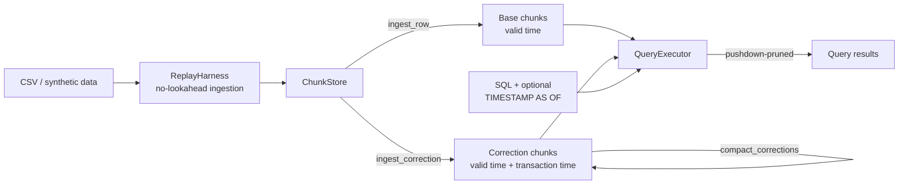

# StreamXor

A chunked, columnar time-series query engine for OHLCV market data with
**bitemporal versioning** — every fact carries both a *valid time* (when it
happened) and a *transaction time* (when the system learned it), so a query
can ask *"what did we know as of time T"* without ever letting a later
correction leak into a past-dated decision. That's the mechanism that keeps a
backtest honest: a strategy can't accidentally benefit from a data revision
that hadn't happened yet at simulated decision time.

Full design write-up: [docs/architecture.md](docs/architecture.md).
Benchmark methodology and the audit that found real bugs: [docs/methodology.md](docs/methodology.md).

## Why this exists

Every chunk of stored data carries a small **zone map** (min/max bounds on
symbol, valid time, price, and transaction time). A query proves entire
chunks irrelevant from that zone map alone and only decompresses the
survivors — conservative predicate pushdown, not compression. Correctness
comes first: every benchmark and most tests assert full row-for-row
equivalence between the pushdown path and a naive full-scan baseline before
any speedup number is ever reported.



## Key features

- **Predicate pushdown** on symbol, valid-time range, and price, via
  conservative per-chunk zone maps — no decompression of provably irrelevant
  chunks.
- **Bitemporal `AS OF` queries** — `SELECT * FROM data TIMESTAMP AS OF '<ts>' WHERE ...`,
  the same syntax and placement Delta Lake and SQL Server use, located via
  targeted tokenization (never a full re-parse) so it can't corrupt or be
  fooled by anything else in the query.
- **Point-in-time correctness by construction** — with zero corrections ever
  ingested, an `AS OF` query is provably identical to a plain time filter;
  this equivalence is asserted directly in the test suite.
- **Correction ingestion and compaction** modeled on Delta Lake's `OPTIMIZE`,
  Apache Hudi's compaction service, and TDSQL's asynchronous
  migration-to-historical-table: writes stay cheap, consolidation is an
  explicit, idempotent, separately-timed operation.
- **A bounded, hand-rolled SQL subset** (comparisons, `AND`, `IN`, date-only
  equality expansion) with unsupported constructs (subqueries, joins, `OR`,
  aggregates) rejected explicitly rather than silently mishandled.
- **Property-based correctness proofs** (`hypothesis`) for the bitemporal
  machinery — equivalence checked across a generated space of random
  correction sets and cutoff times, not just hand-picked examples.
- **A rigorous, statistically-honest benchmark suite** — 95% confidence
  intervals, significance testing between measurements, and an
  outlier-robust trimmed-mean estimator applied consistently across every
  script, so a performance claim is backed by a number that's actually
  distinguishable from noise.
- **Clean, consistent benchmark output** — every `bench_*.py` script ends its
  run with one aligned summary table (`benchmarks/report.py`), instead of
  scattered narrative print statements with inconsistent naming across
  scripts.
- **Two independent audits, both documented honestly** — the second pass
  found a real regression in the first pass's own fix, a misleading chart, a
  broken script, and a silent contract violation, each with a before/after
  measurement or reproduction. See
  [docs/methodology.md §4–5](docs/methodology.md#4-the-first-audit-finding-correctness-and-performance-bugs-with-evidence-not-guesses)
  for the full story, including the dead ends.

## Project layout

```
src/
  replay/        CSV loading + the strict, no-lookahead ingestion iterator
  store/         ChunkLabel (zone map), Chunk, ChunkBuilder, ChunkBoundary, ChunkStore
  query/         SQL parsing, predicate IR, pushdown, bitemporal versioning, executor
  baselines/     Naive full-scan engine (the correctness/speed baseline)
  pipeline.py    CLI: ingest a CSV, run queries, optionally benchmark
benchmarks/      The full benchmark suite (see docs/methodology.md)
charts/          Chart generation from benchmark JSON results
tests/           Unit, property-based, and end-to-end tests
data/            Committed real market-data fixtures (Yahoo Finance via yfinance)
docs/            architecture.md, methodology.md
```

## Getting started

```bash
# environment
python3 -m venv .venv
.venv/bin/pip install --upgrade pip
.venv/bin/pip install -r requirements.txt
.venv/bin/pip install -e .

# (optional) re-download the market-data fixtures -- committed CSVs already
# ship in data/cache/, so this is only needed to refresh them
python data/download_data.py

# run the test suite
pytest -q

# run the CLI: ingest a CSV and issue queries
python -m src.pipeline --data-csv data/cache/all_symbols_daily.csv \
    --query "SELECT * FROM data WHERE symbol = 'AAPL' AND date = '2024-03-01'"

# an AS OF (bitemporal) query -- same syntax as Delta Lake / SQL Server
python -m src.pipeline --data-csv data/cache/all_symbols_daily.csv \
    --query "SELECT * FROM data TIMESTAMP AS OF '2024-06-01T00:00:00Z' WHERE symbol = 'AAPL'"
```

A `Makefile` wraps the common commands: `make setup`, `make test`, `make bench`,
`make bench-scale`, `make charts`, `make all`.

## Running the benchmark suite

```bash
pytest -q && ruff check .                       # correctness gate first

python benchmarks/run_all.py --memory           # Q1-Q5 + selectivity sweep + memory
python benchmarks/bench_scale.py                # synthetic scale sweep, 1x-1000x (slow)
python benchmarks/bench_bitemporal.py           # correction-volume sweep (slow, ~5 min)
python benchmarks/bench_chunk_granularity.py    # chunk-boundary trade-off sweep

python charts/generate_all.py                   # regenerate every chart from results/
```

Each script prints one clean, aligned summary table at the end of its run —
`bench_bitemporal.py`'s table, for example, shows every correction rate
against every scenario (ordinary query vs. `AS OF`, before vs. after cleanup)
in a single 5-row table, not five separate narrative blocks.

Results land in `benchmarks/results/*.json`; charts land in
`charts/output/*.png`. Every number reported in
[docs/methodology.md](docs/methodology.md) comes from these scripts — nothing
is hand-computed.

## Headline results

| | |
|---|---|
| Narrow query speedup (Q1, real daily market data) | **~40–46x** vs. full scan, 99.6% of chunks skipped |
| Speedup at 1000x synthetic scale (10,000 symbols, 5M rows) | **~630x** for a narrow symbol query |
| `AS OF` query speedup at 50% correction density | **~11x**, widening as correction volume grows |
| `compact_corrections()` fix | **~30–45x faster** (2.24s → ~50–70ms) after fixing an O(n²) bug found via profiling |
| Chunk-granularity trade-off | weekly boundaries: ~63–70x speedup / 1,010 chunks vs. quarterly: ~19–20x / 80 chunks |
| Column-payload memory footprint | **~2.7x smaller** than the equivalent raw pandas DataFrame |

See [docs/methodology.md](docs/methodology.md) for the full numbers, how they
were measured, and the story of the audit that found and fixed the real bugs
behind some of them.

## Testing

```bash
pytest -q          # full suite: unit, property-based (hypothesis), end-to-end
ruff check .        # lint
```

The test suite includes property-based equivalence proofs
(`tests/test_compaction.py`, `tests/test_as_of_index.py`) that check
correctness across a *generated* space of random inputs, not just fixed
examples — see [docs/methodology.md §1](docs/methodology.md#1-correctness-philosophy).

## License

See [LICENSE](LICENSE).
