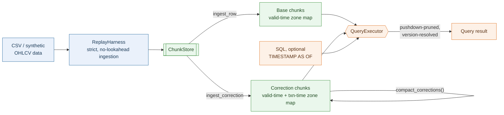
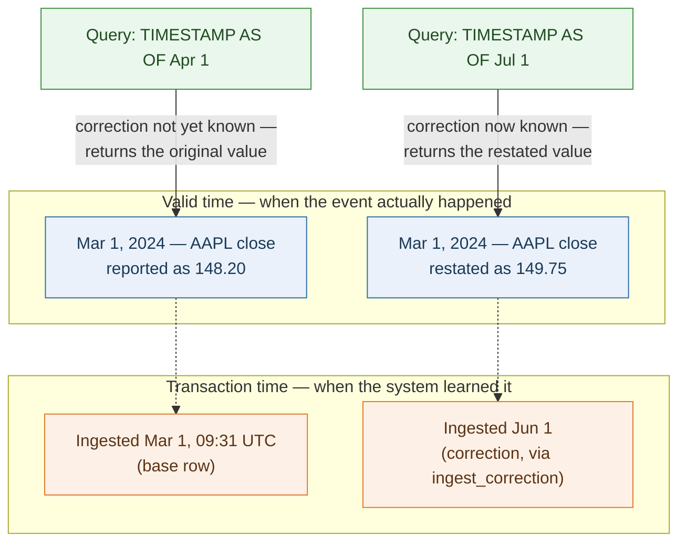
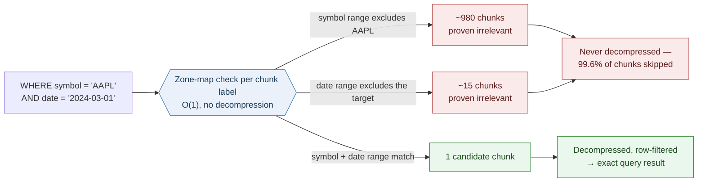
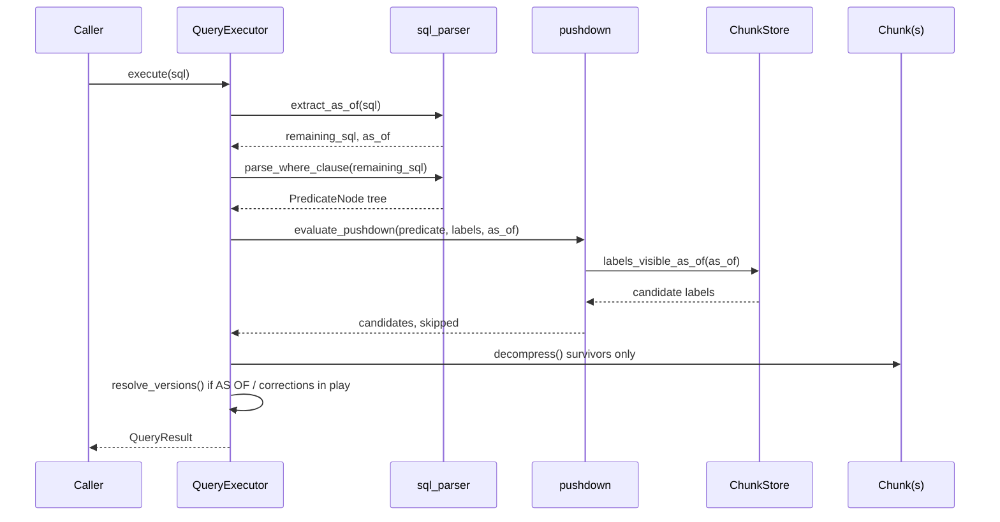
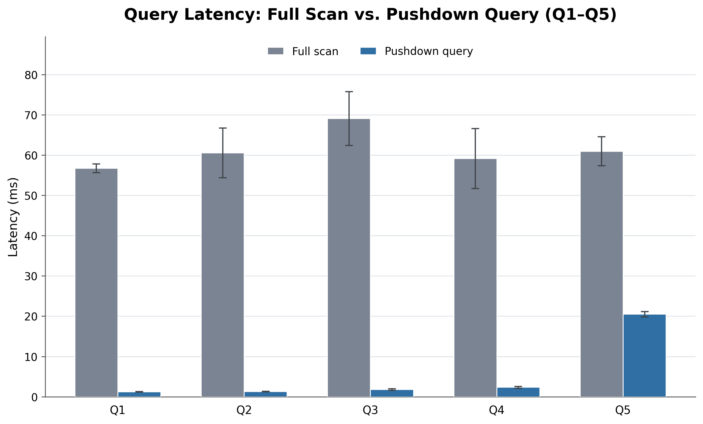
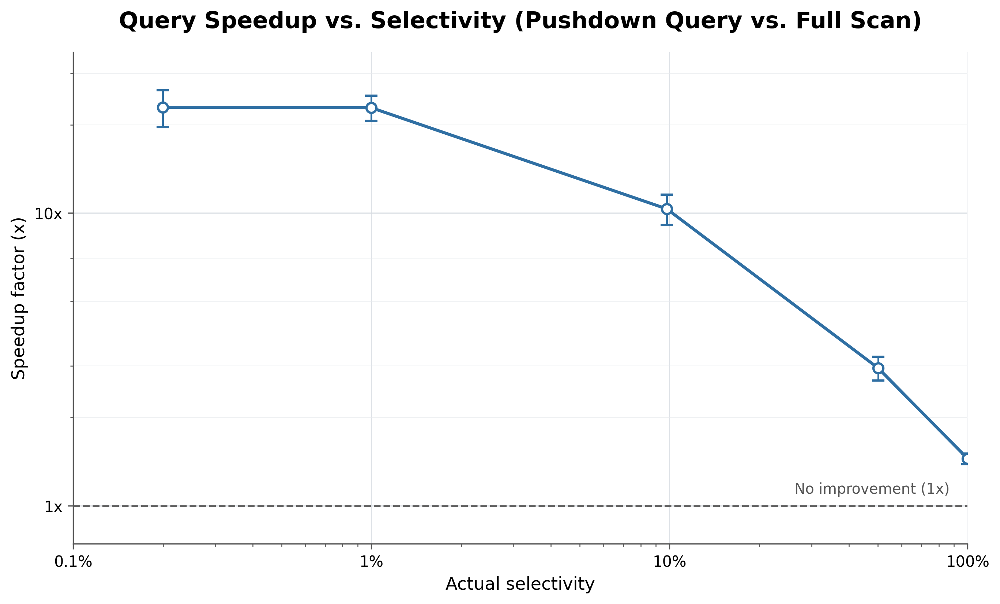
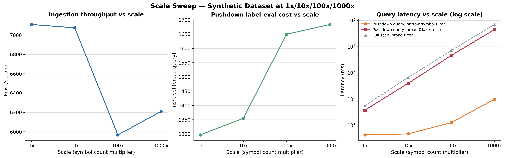
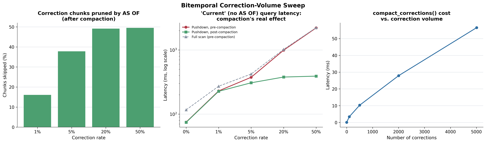
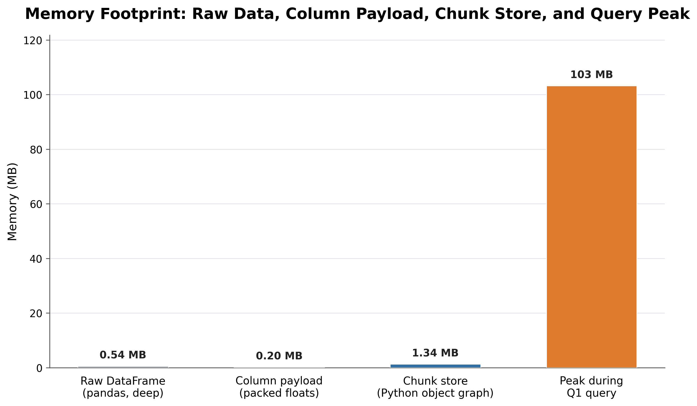

<div align="center">

# PitDB

**A chunked, columnar, bitemporal time-series query engine for OHLCV market data**

*Predicate pushdown that proves chunks irrelevant instead of decompressing to find out —
and an `AS OF` query semantics that makes look-ahead bias structurally impossible.*


[Architecture deep-dive](ARCHITECTURE.md) · [Benchmark methodology](METHODOLOGY.md) · [Getting started](#getting-started)

</div>

<br/>

Every chunk of stored data carries a small **zone map** — min/max bounds on
symbol, valid time, price, and transaction time. A query proves entire
chunks irrelevant from that zone map alone and only decompresses the
survivors: conservative predicate pushdown, not compression. Layered on top
of that, every fact carries both a **valid time** (when it happened) and a
**transaction time** (when the system learned it), so a query can ask *"what
did we know as of time T"* without ever letting a later correction leak into
a past-dated decision — the mechanism that keeps a backtest honest.

Correctness comes first, throughout: every benchmark and most tests assert
full row-for-row equivalence between the pushdown path and a naive full-scan
baseline before any speedup number is reported.

## At a glance

| | |
|---|---|
| Narrow-query speedup (real daily market data) | **40–46x** vs. full scan · 99.6% of chunks skipped |
| Speedup at 1000x synthetic scale (10,000 symbols, 5M rows) | **629.70x** |
| `AS OF` speedup at 50% correction density | **11.34x**, climbing as correction volume grows |
| Storage efficiency (packed column payload vs. raw DataFrame) | **~2.7x** smaller |
| `compact_corrections()` fix | 2.24s → **~50–70ms** after an O(n²) bug found via profiling |
| Correctness proofs | property-based (`hypothesis`) equivalence checks, not just fixed examples |
| Engineering audits | 2 independent passes · **15 real bugs** found and fixed, each with a before/after measurement |
| Test suite | **119 tests** passing — unit, property-based, end-to-end |

## Contents

- [Architecture](#architecture)
  - [System overview](#system-overview)
  - [Bitemporal versioning: valid time vs. transaction time](#bitemporal-versioning-valid-time-vs-transaction-time)
  - [How zone-map pruning works](#how-zone-map-pruning-works)
  - [Query execution flow](#query-execution-flow)
- [Benchmark results](#benchmark-results)
- [Engineering rigor: two independent audits](#engineering-rigor-two-independent-audits)
- [Key features](#key-features)
- [Project layout](#project-layout)
- [Getting started](#getting-started)
- [Running the benchmark suite](#running-the-benchmark-suite)
- [Testing](#testing)
- [Documentation](#documentation)
- [License](#license)

## Architecture

### System overview



**What it's showing:** the full data path, left to right. Rows are replayed
through a strict no-lookahead iterator (blue) into per-symbol chunks (green)
— base rows via `ingest_row`, corrections via a deliberately separate
`ingest_correction` path that never touches a live builder's state.
`QueryExecutor` (amber) is the only thing that ever reads both chunk kinds
together, pruning by zone map before decompressing anything. The split
between base and correction chunks is what makes bitemporal storage and
ordinary time-series storage share one code path instead of two.

### Bitemporal versioning: valid time vs. transaction time



**What it's showing:** the same real-world event (AAPL's March 1 close) has
one valid time but two transaction times, because the exchange restated the
print three months later. A query pinned `AS OF Apr 1` cannot see the
correction — it hadn't happened *yet*, from the system's point of view — and
returns the original value; a query `AS OF Jul 1` sees the restated one.
This is the exact mechanism that stops a backtest from accidentally
benefiting from a data revision that hadn't occurred at simulated decision
time. With zero corrections ever ingested, this collapses to a plain time
filter — asserted directly in the test suite, not just claimed.

### How zone-map pruning works



**What it's showing:** the actual shape of the Q1 benchmark query against
real daily market data — a narrow symbol + date predicate. Every chunk's
zone map is checked against the predicate; a `False` result is a *proof* of
non-membership, never a guess, so the engine can discard a chunk with
complete confidence it contains no matching row. Only the chunk(s) that
survive every check get decompressed and row-filtered. This is the entire
mechanism behind the 40–46x speedup above — not compression, not indexing
tricks, just proving most of the data doesn't need to be read at all.

### Query execution flow



**What it's showing:** one query's actual call path, end to end. The `AS OF`
clause is located and stripped by tokenizer before the `WHERE` clause is
parsed, so the two concerns can never interfere with each other. Pushdown
runs *before* any decompression — `ChunkStore`'s transaction-time index
answers "which chunks might be visible as of T" in O(log n) instead of a
linear scan. Version resolution (latest-transaction-time-wins) only runs
when it can actually matter, keeping the ordinary, no-corrections path free
of overhead it doesn't need.

## Benchmark results

Every figure below is read directly from `benchmarks/results/*.json`,
regenerated by the commands in [Running the benchmark suite](#running-the-benchmark-suite)
— nothing is hand-computed, and every number passed the same full-equivalence
correctness gate before being reported. Full numbers, methodology, and the
audit trail: [METHODOLOGY.md](METHODOLOGY.md).

<p align="center">
  
</p>

**Query latency, full scan vs. pushdown (Q1–Q5, real market data).** Five
fixed queries of decreasing selectivity, same data, same predicate, two
engines. The pushdown bars barely register next to full scan for the narrow
queries (Q1–Q3); the gap visibly narrows toward Q5, the one query that
genuinely needs half the table — the honest floor of what pruning alone can
do, shown rather than hidden.

<p align="center">
  
</p>

**Speedup as a function of selectivity.** A log-log sweep from a query
touching 100% of the data down to 0.1% of it. The relationship is smooth and
monotonic — speedup climbs from ~1.5x at 100% selectivity to ~20–25x at
0.1% — exactly what "skip chunks you can prove don't match" predicts, with
no discontinuities that would suggest a benchmarking artifact.

<p align="center">
  
</p>

**Scale sweep, 1x → 1000x (10 → 10,000 symbols, up to 5M rows).** The
narrow-query speedup *grows* with scale — 11.72x at 1x, 629.70x at 1000x —
because full-scan cost is linear in chunk count while a narrow pushdown
query's cost stays essentially flat. The per-label pushdown-evaluation cost
stays within a tight ~1.3–1.7 microsecond band across the entire 1000x range,
confirming the pruning check itself doesn't degrade as the store grows.

<p align="center">
  
</p>

**Bitemporal correction-volume sweep.** Two independent switches — which
question (`current` vs. `AS OF`) and when you ask it (pre- vs.
post-compaction) — swept across correction rates from 0% to 50%. The
ordinary query stays close to 1x throughout; the `AS OF` query is where
pushdown's advantage is dramatic, climbing to 11.34x at 50% correction
density right after corrections land, because every correction chunk that
postdates the cutoff can be proven irrelevant and skipped without
decompression.

<p align="center">
  
</p>

**Memory footprint.** The fair, apples-to-apples comparison — packed
`float64` column payload vs. `pandas`' own deep memory accounting of the raw
DataFrame — shows a real **~2.7x** reduction (0.20 MB vs. 0.54 MB). The chunk
store's full Python object-graph size is charted too, but explicitly
labeled as a different accounting method rather than presented as a
misleading like-for-like comparison — a real chart defect from an earlier
pass, found and fixed during the second audit.

<details>
<summary><b>Full headline-results tables</b> (pushdown pruning by query, intraday data, chunk-granularity trade-off, compaction)</summary>

<br/>

**Pushdown pruning — Dataset A (daily bars, real market data)**

| Query | Predicate | Selectivity | Chunks skipped | Speedup |
|---|---|---:|---:|---:|
| Q1 | `symbol = X AND date = Y` | 0.02% | 99.6% | **40–46x** |
| Q2 | narrow date range | 0.4% | 99.6% | **46–49x** |
| Q3 | `symbol IN (...)` + range | 0.2% | 99.2% | **35–41x** |
| Q4 | price + date range | 2.8% | 97.1% | **23–25x** |
| Q5 | broad date-only (50% selectivity) | 50.1% | 50.0% | **2.7–3.1x** |

**Pushdown pruning — Dataset B (intraday, 1-minute bars)**

| Query | Selectivity | Chunks skipped | Speedup |
|---|---:|---:|---:|
| `narrow_symbol_hour` | 0.36% | 99.7% | **89–109x** |
| `price_threshold` | 2.9% | 96.7% | **~40x** |
| `broad_full_range` | 100.0% | 0.0% | **2.6–2.7x** |

**Chunk-granularity trade-off** (pruning precision vs. chunk-management overhead)

| Granularity | Chunks | Avg. rows/chunk | Chunks skipped | Speedup |
|---|---:|---:|---:|---:|
| Weekly | 1,010 | 5.0 | 99.7% | **71–73x** |
| Monthly (default) | 240 | 20.9 | 99.2% | ~30–31x |
| Quarterly | 80 | 62.6 | 97.5% | ~19–20x |

**Compaction.** After the O(n²) fix (§4 of the methodology doc), compacting
5,010 correction chunks (50% correction rate) completes in **~50–70ms**,
down from an original 2.24 seconds — **~30–45x** faster, confirmed linear
(not quadratic) scaling across four correction-volume points.

</details>

## Engineering rigor: two independent audits

The project was audited twice, deliberately — the second pass covering
performance and benchmark-methodology honesty specifically, not just
correctness. Both are documented in full, including the dead ends:
[METHODOLOGY.md §4–5](METHODOLOGY.md#4-the-first-audit-finding-correctness-and-performance-bugs-with-evidence-not-guesses).

<details>
<summary><b>First audit — 7 correctness bugs + a real O(n²) performance bug, each found by measurement</b></summary>

<br/>

- A benchmark showing `AS OF` latency creeping upward with correction volume
  was traced with direct timing, then `cProfile`, to `ChunkStore._remove_chunk`
  rebuilding its entire chunk list once **per removed chunk** — O(k·n) instead
  of O(k) for k removals. Fixed with a single batched filtering pass; the same
  compaction call dropped from 2.24s to ~50–70ms.
- A second cost center — `chunk.decompress()` building a full DataFrame just
  to read one row via `.iloc[]` — was fixed with a `column_arrays()` path that
  skips DataFrame construction entirely.
- An apparent regression from compaction turned out to be two overlapping
  95% confidence intervals — not a real effect, caught by `intervals_overlap`
  rather than trusting point estimates across separate process runs.
- A single-outlier-trial artifact (one CI three-to-eight times wider than
  every sibling measurement) was fixed with a one-sided trimmed mean.
- A separate, independent pass through the bitemporal query path found **7
  real correctness bugs** — most seriously, a chain where predicate pushdown
  could prune a correction chunk by its own stale price *before* version
  resolution ran, letting a superseded value silently leak into a result.
  Every fix shipped with a regression test reproducing the exact failure
  first.

</details>

<details>
<summary><b>Second audit — 8 more issues: a regression in the first audit's own fix, a misleading chart, a broken script, and more</b></summary>

<br/>

- **A correctness regression in the first audit's own fix**: a regex-based
  `AS OF` clause detector could be defeated by a SQL comment containing the
  word "where". Replaced with tokenizer-based extraction, immune to both
  comments and string-literal content by construction.
- **A redundant sort**, confirmed via a same-process A/B test (not assumed):
  ~0.53ms / 6.4% removed from a 5,000-row bitemporal query.
- **Benchmark methodology gaps**: the outlier-robust trimmed-mean estimator
  built for one script hadn't been extended to three others — traced to a
  chart point whose confidence interval was *wider than its own mean*.
- **A misleading memory chart** comparing two incompatible accounting
  methods — fixed by charting a number that was already computed but never
  shown (the memory chart above).
- **A broken script**, caught by actually running it: `KeyError` on its
  first line from a stale naming scheme. Deleted; its functionality was
  already covered correctly elsewhere.
- **A silent contract violation**: an index fast path returned chunk IDs in
  a different order than the linear scan it was meant to be interchangeable
  with — no visible query-result impact, but a real gap between a documented
  guarantee and the code, closed and covered by an upgraded property test.
- **Unified console output**: five independently hand-rolled print layouts,
  drifted out of sync with each other (different units, different field
  names for the same value), replaced with one shared table renderer.

</details>

## Key features

- **Predicate pushdown** on symbol, valid-time range, and price, via
  conservative per-chunk zone maps — no decompression of provably irrelevant
  chunks.
- **Bitemporal `AS OF` queries** — `SELECT * FROM data TIMESTAMP AS OF '<ts>' WHERE ...`,
  the same syntax and placement Delta Lake and SQL Server use, located via
  targeted tokenization so it can't be corrupted or fooled by anything else
  in the query.
- **Point-in-time correctness by construction** — with zero corrections ever
  ingested, an `AS OF` query is provably identical to a plain time filter;
  asserted directly in the test suite.
- **Correction ingestion and compaction** modeled on Delta Lake's `OPTIMIZE`,
  Apache Hudi's compaction service, and TDSQL's asynchronous
  migration-to-historical-table: writes stay cheap, consolidation is an
  explicit, idempotent, separately-timed operation.
- **A bounded, hand-rolled SQL subset** (comparisons, `AND`, `IN`, date-only
  equality expansion) with unsupported constructs (subqueries, joins, `OR`,
  aggregates) rejected explicitly rather than silently mishandled.
- **Property-based correctness proofs** (`hypothesis`) for the bitemporal
  machinery — equivalence checked across a generated space of random
  correction sets and cutoff times, not just hand-picked examples.
- **A rigorous, statistically-honest benchmark suite** — 95% confidence
  intervals, significance testing between measurements, and an
  outlier-robust trimmed-mean estimator applied consistently across every
  script.
- **Clean, consistent benchmark output** — every `bench_*.py` script ends
  its run with one aligned summary table (`benchmarks/report.py`).

## Project layout

```
src/
  replay/        CSV loading + the strict, no-lookahead ingestion iterator
  store/         ChunkLabel (zone map), Chunk, ChunkBuilder, ChunkBoundary, ChunkStore
  query/         SQL parsing, predicate IR, pushdown, bitemporal versioning, executor
  baselines/     Naive full-scan engine (the correctness/speed baseline)
  pipeline.py    CLI: ingest a CSV, run queries, optionally benchmark
benchmarks/      The full benchmark suite (see METHODOLOGY.md)
charts/          Chart generation from benchmark JSON results
tests/           Unit, property-based, and end-to-end tests
data/            Committed real market-data fixtures (Yahoo Finance via yfinance)
ARCHITECTURE.md  Full system design (see below)
METHODOLOGY.md   Correctness philosophy, benchmark design, and audit trail
```

## Getting started

```bash
# environment
python3 -m venv .venv
.venv/bin/pip install --upgrade pip
.venv/bin/pip install -r requirements.txt
.venv/bin/pip install -e .

# (optional) re-download the market-data fixtures -- committed CSVs already
# ship in data/cache/, so this is only needed to refresh them
python data/download_data.py

# run the test suite
pytest -q

# run the CLI: ingest a CSV and issue queries
python -m src.pipeline --data-csv data/cache/all_symbols_daily.csv \
    --query "SELECT * FROM data WHERE symbol = 'AAPL' AND date = '2024-03-01'"

# an AS OF (bitemporal) query -- same syntax as Delta Lake / SQL Server
python -m src.pipeline --data-csv data/cache/all_symbols_daily.csv \
    --query "SELECT * FROM data TIMESTAMP AS OF '2024-06-01T00:00:00Z' WHERE symbol = 'AAPL'"
```

A `Makefile` wraps the common commands: `make setup`, `make test`, `make bench`,
`make bench-scale`, `make charts`, `make all`.

## Running the benchmark suite

```bash
pytest -q && ruff check .                       # correctness gate first

python benchmarks/run_all.py --memory           # Q1-Q5 + selectivity sweep + memory
python benchmarks/bench_scale.py                # synthetic scale sweep, 1x-1000x (slow)
python benchmarks/bench_bitemporal.py           # correction-volume sweep (slow, ~5 min)
python benchmarks/bench_chunk_granularity.py    # chunk-boundary trade-off sweep

python charts/generate_all.py                   # regenerate every chart from results/
```

Each script prints one clean, aligned summary table at the end of its run.
Results land in `benchmarks/results/*.json`; charts land in
`charts/output/*.png`. Every number reported in
[METHODOLOGY.md](METHODOLOGY.md) comes from these scripts — nothing
is hand-computed.

## Testing

```bash
pytest -q          # full suite: unit, property-based (hypothesis), end-to-end
ruff check .        # lint
```

The test suite includes property-based equivalence proofs
(`tests/test_compaction.py`, `tests/test_as_of_index.py`) that check
correctness across a *generated* space of random inputs, not just fixed
examples — see [METHODOLOGY.md §1](METHODOLOGY.md#1-correctness-philosophy).

## Documentation

| Document | Covers |
|---|---|
| [ARCHITECTURE.md](ARCHITECTURE.md) | Full system design: storage model, query engine internals, bitemporal versioning, the transaction-time index, and a table of every design decision with its rationale |
| [METHODOLOGY.md](METHODOLOGY.md) | Correctness philosophy, benchmark design, every verified number behind this README, and the full story of both audits |

## License

See [LICENSE](LICENSE).
</content>
